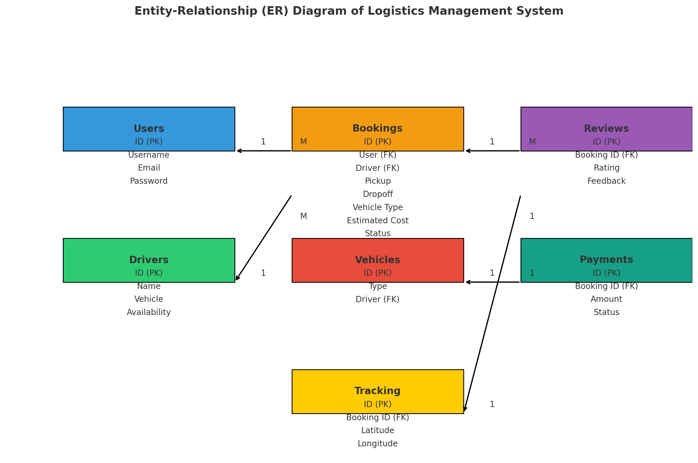
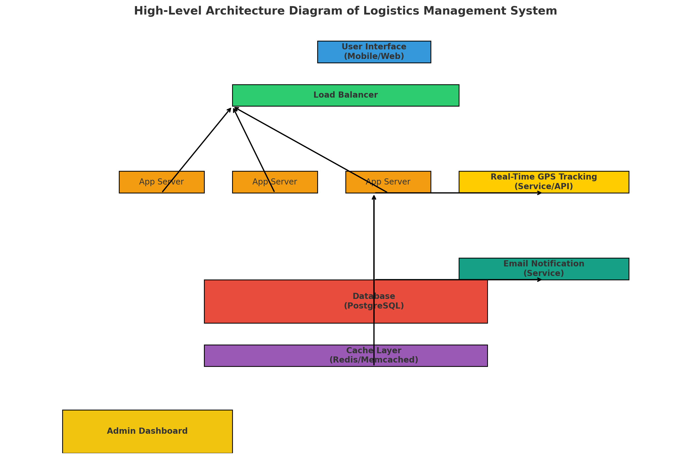

# On-Demand Logistics Platform

## Overview
This application is an **On-Demand Logistics Platform** built using **Streamlit** for the frontend and **SQLite** for data storage. It provides logistics services that allow users to register, book vehicles, track shipments, and provide feedback on deliveries. The platform includes basic functionalities for drivers and admins to manage their interactions and monitor the service.

## Video Demo
[Watch the demo video](AkshatLOG.webm)


## Features
- **User Registration/Login**: Users can register and log in to the platform by providing their username, email, and password.
- **Vehicle Booking**: Users can book vehicles (car, van, truck) by selecting pickup and dropoff locations. The app estimates the price based on the distance and vehicle type.
- **Real-Time Tracking**: After booking, users can track the location of their vehicle on a map.
- **Feedback and Reviews**: After delivery, users can provide feedback and rate the service.
- **Admin Logs**: Admins can log actions and check the logs for auditing purposes.
- **Email Notifications**: Booking confirmations are sent via email to the user.
- **Driver Management**: A simple system for assigning drivers and tracking earnings.

## Technologies Used
- **Streamlit**: For the web interface and interactivity.
- **SQLite**: For local database management.
- **Geopy**: For calculating distances between pickup and dropoff locations.
- **Folium**: For mapping and real-time vehicle tracking.
- **Smtplib**: For sending email notifications.
- **Pandas**: For data manipulation.
- **HTML and CSS**: For custom styling of the web interface.

## Setup Instructions

### 1. Install Python
Ensure you have Python installed on your machine. You can download it from [python.org](https://www.python.org/downloads/). Make sure you have Python 3.6 or higher.


### 2. Database Setup

The application will automatically create the necessary tables in `logistics.db` if they don't already exist:

## Tables

- **users**: Stores user information
  - ID
  - username
  - email
  - password

- **bookings**: Stores booking information
  - ID
  - user
  - driver
  - pickup
  - dropoff
  - vehicle
  - estimated cost
  - status
  - favorite driver

- **drivers**: Stores driver details
  - ID
  - name
  - vehicle
  - availability
  - earnings

- **tracking**: Stores vehicle tracking data
  - booking ID
  - latitude
  - longitude

- **reviews**: Stores user feedback and ratings
  - booking ID
  - rating
  - feedback

- **admin_logs**: Logs admin actions
  - ID
  - action
  - timestamp

# Configuration

To modify the `send_email` function with your Gmail credentials, update the following variables in your code:

```python
from_address = "your_email@gmail.com"
password = "your_app_specific_password"

```


## Evaluation Criteria Analysis

### 1. System Design

#### Scalability and Performance
- The application currently uses SQLite for local data storage, suitable for medium scale development and testing.
- To handle up to 10,000 requests per second, 100,000 drivers, and 50 million users, we propose migrating to a distributed database solution such as PostgreSQL or Cassandra for improved scalability.
- Load balancers will be utilized to distribute incoming requests across multiple application instances, ensuring consistent performance during peak traffic.

#### Real-Time Data Handling
- The app simulates real-time GPS tracking and can manage live updates.
- Implementation of WebSockets or server-sent events is planned to allow real-time communication of vehicle locations and booking statuses.
- Integration with a message broker Apache Kafka will facilitate real-time processing of booking events and vehicle tracking data, ensuring scalability and reliability.

#### Database Design
- The database schema supports user registrations, bookings, driver management, tracking data, and reviews.
- We have used indexing on frequently queried fields (e.g., `user_id`, `driver_id`, `status`) to enhance query performance.
- We have also explored sharding and replication strategies to distribute the database load and provide redundancy, ensuring data availability and resilience.

### 2. App Implementation

#### Functionality
- Users can register, book rides, estimate prices based on distance, and track vehicles.
- Price estimation utilizes the Geopy library for accurate distance measurements between pickup and drop-off points.

#### Code Quality
- The code adheres to good programming practices, featuring modular functions for key operations such as price estimation, email notifications, and booking management.
- Organized code structure ensures maintainability and scalability.

#### Creativity
- Unique features like email notifications for booking confirmations enhance user experience.
- Future enhancements include ride-sharing options and dynamic pricing models based on demand and availability.

### 3. Communication and Presentation

#### Clarity
- Presentations clearly articulate design choices and application functionality, emphasizing component contributions to overall performance and user experience.

#### Depth
- Comprehensive understanding of scalability, system performance, and real-time data handling is demonstrated.
- Ability to address potential limitations and propose innovative solutions reflects a strong grasp of the challenges in developing a large-scale logistics platform.

## Entity Relationship Diagram (ER)


## High-Level Diagram (HLD)


